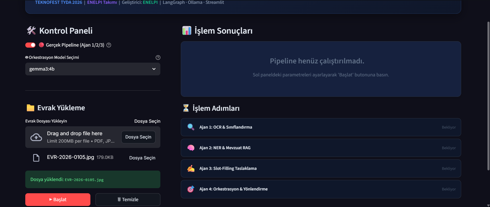
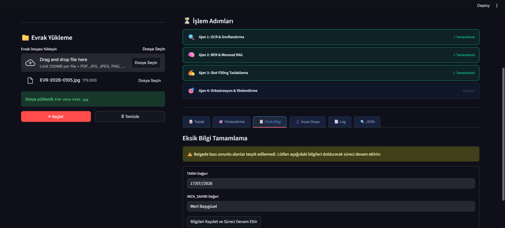
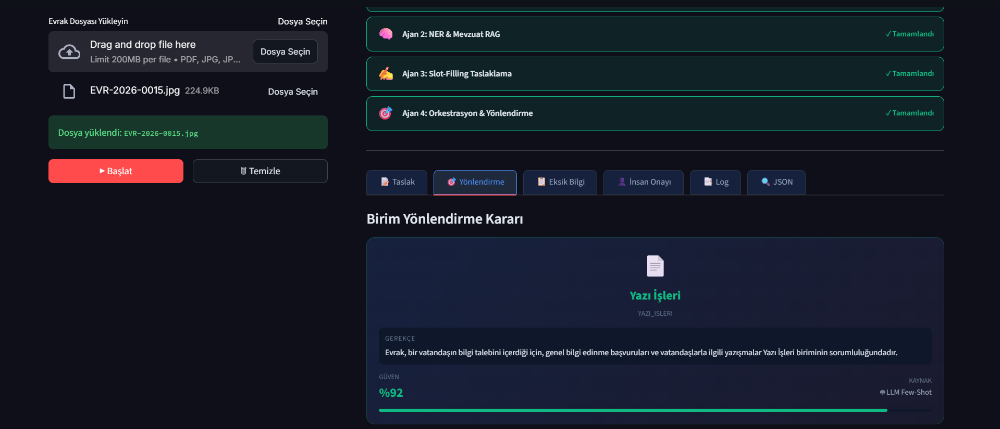
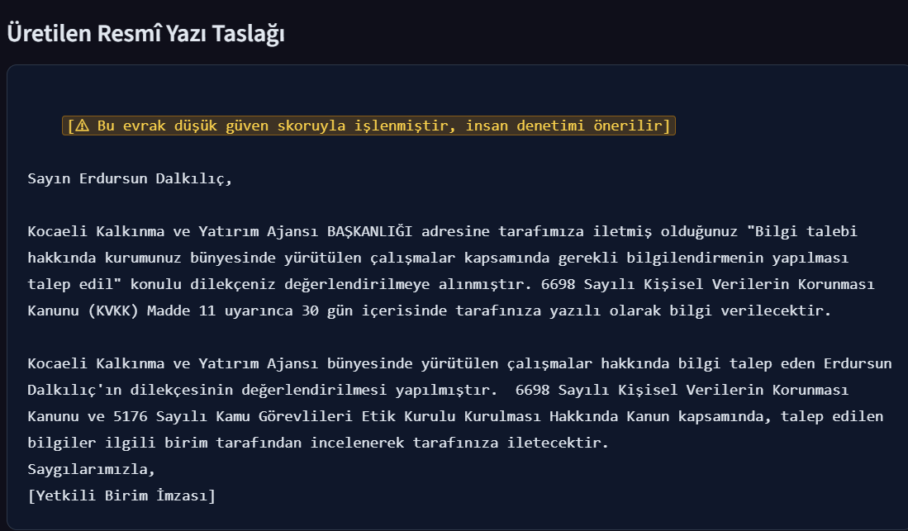

# 🎯 TEKNOFEST TYDA 2026 — ENELPİ

<div align="center">

**Çok Ajanlı Kamu Evrak Orkestrasyon Sistemi**

[](https://python.org)
[](https://github.com/langchain-ai/langgraph)
[](https://streamlit.io)
[](https://ollama.com)
[](LICENSE)

*TEKNOFEST 2026 — Türkçe Yapay Zeka Dil Ajanları (TYDA) Yarışması*

</div>

---

## 📋 Proje Özeti

Bu proje, kamu kurumlarına gelen resmî evrakların **uçtan uca otomatik işlenmesi** için tasarlanmış çok ajanlı (multi-agent) bir NLP sistemidir. Sistem, taranmış veya dijital evrakları okuyarak sınıflandırır, içerik analizi ve mevzuat eşleştirmesi yapar, resmî yazı taslağı üretir ve uygun birime yönlendirir.

### 🏗️ Sistem Mimarisi

```
Evrak Girişi (PDF/JPG/TXT)
       │
       ▼
┌─────────────────────────────┐
│  Ajan 1: OCR & Sınıflandırma │  ← Tesseract 5.3 + TF-IDF/SGD
│  (Evrak Okuma)               │
└──────────────┬──────────────┘
               │ JSON v1.0
               ▼
┌─────────────────────────────┐
│  Ajan 2: NER & Mevzuat RAG  │  ← Gemma2 + ChromaDB
│  (İçerik Analizi)            │
└──────────────┬──────────────┘
               │ JSON v1.0
               ▼
┌─────────────────────────────┐
│  Ajan 3: Slot-Filling        │  ← Hibrit Şablon + LLM
│  (Resmî Yazı Taslaklama)     │
└──────────────┬──────────────┘
               │ JSON v1.0
               ▼
┌─────────────────────────────┐
│  Ajan 4: Orkestrasyon        │  ← LangGraph + Few-Shot LLM
│  (Birim Yönlendirme & UI)   │
└─────────────────────────────┘
               │
               ▼
    Yönlendirilmiş Resmî Yazı
    + Kullanıcı Bildirimi
```

---

## 👥 Ekip Üyeleri

| Üye | Rol | Sorumluluk |
|-----|-----|------------|
| **Fatma Nur Toklu** *(Kaptan)* | Ajan 2 Geliştiricisi / NLP Uzmanı | NER, RAG mimarisi, ChromaDB entegrasyonu |
| **Yusuf Kalkan** | Ajan 1 Geliştiricisi / Veri Mimarı | OCR, metin sınıflandırma, sentetik veri üretimi |
| **Muhammed Can Akbaş** | Ajan 3 Geliştiricisi / Yazılım Mimarı | Slot-filling, şablon motoru, üslup kontrolü |
| **Yasin Taha İnal** | Ajan 4 Geliştiricisi / Sistem Entegratörü | LangGraph, orkestrasyon, UI tasarımı |

---

## 🚀 Kurulum ve Başlatma

### Ön Gereksinimler

| Bileşen | Versiyon | Açıklama |
|---------|----------|----------|
| **Python** | 3.11+ | Ana çalışma ortamı |
| **Ollama** | Latest | Yerel LLM sunucusu |
| **Tesseract** | 5.3+ | OCR motoru (opsiyonel — yoksa mock mod çalışır) |
| **Git** | Latest | Versiyon kontrol |

### 1. Depoyu Klonlayın

```bash
git clone https://github.com/fatmaNurToklu/ENELPI.git
cd ENELPI
```

### 2. Sanal Ortam Oluşturun (Önerilen)

```bash
python -m venv venv

# Windows
venv\Scripts\activate

# Linux/macOS
source venv/bin/activate
```

### 3. Bağımlılıkları Yükleyin

```bash
pip install -r requirements.txt
```

### 4. Ollama Modellerini İndirin

```bash
# LLM modeli (zorunlu)
ollama pull gemma3:4b

# Embedding modeli (Ajan 2 RAG için zorunlu)
ollama pull nomic-embed-text

# Opsiyonel: Daha güçlü model
ollama pull gemma2:9b
```

> **Not:** Ollama'nın arka planda çalışıyor olması gerekir. `ollama serve` komutuyla başlatabilirsiniz.

### 5. ChromaDB Mevzuat Veritabanını Yükleyin

```bash
cd agent2
python chroma_yukle.py
cd ..
```

> Bu adım, mevzuat metinlerini vektörleştirerek `chroma_veri/` klasörüne kaydeder. Yalnızca ilk kurulumda gereklidir.

### 6. Uygulamayı Başlatın

```bash
python run.py
```

Uygulama varsayılan olarak **Streamlit** arayüzünü başlatır:
- 🌐 **Yerel:** `http://localhost:8501`

### Alternatif Başlatma Modları

```bash
# Gradio arayüzü
python run.py --gradio

# CLI modu (belirli senaryo)
python run.py --cli --senaryo TASLAK_HAZIR

# Test paketi
python run.py --test
```

---

## 📁 Proje Yapısı

```
ENELPI/
├── agent1/                  # Ajan 1: OCR & Sınıflandırma
│   ├── agent1.py            # Ana ajan mantığı
│   └── ...
├── agent2/                  # Ajan 2: NER & Mevzuat RAG
│   ├── agent2.py            # Ana ajan mantığı
│   ├── chroma_yukle.py      # ChromaDB veri yükleyici
│   └── chroma_veri/         # Vektör veritabanı
├── agent3/                  # Ajan 3: Slot-Filling Taslaklama
│   ├── agent3.py            # Ana ajan mantığı
│   └── ...
├── agent4/                  # Ajan 4: Orkestrasyon & UI
│   ├── graph.py             # LangGraph durum grafiği
│   ├── state.py             # Merkezi durum tanımı
│   ├── nodes/               # LangGraph düğümleri
│   │   ├── mock_agents_node.py
│   │   ├── real_agents_node.py
│   │   ├── routing_node.py
│   │   └── output_node.py
│   ├── adapters/            # Ajan adaptörleri
│   └── ui/                  # Gradio arayüz (alternatif)
├── info/                    # Proje dokümantasyonu & veri sözleşmeleri
├── tests/                   # Test dosyaları
├── app_streamlit.py         # Ana Streamlit arayüzü
├── run.py                   # Uygulama başlatıcı
├── requirements.txt         # Python bağımlılıkları
├── LICENSE                  # MIT Lisansı
└── README.md                # Bu dosya
```

---

## 🎮 Kullanım

### Demo Modu
Gerçek ajan kodları olmadan sistemi test etmek için:
1. Arayüzde **"Gerçek Pipeline"** toggle'ını kapatın
2. Demo senaryosunu seçin (Normal Akış, Eksik Bilgi, Manuel İnceleme, Yeniden Deneme)
3. **"Başlat"** butonuna tıklayın

### Gerçek Pipeline Modu
1. **"Gerçek Pipeline"** toggle'ının açık olduğundan emin olun (varsayılan: açık)
2. PDF, JPG, PNG veya TXT formatında bir evrak yükleyin
3. **"Başlat"** butonuna tıklayın
4. İlerleme çubuğunu takip edin
5. Sonuçları farklı sekmelerde inceleyin:
   - **📝 Taslak:** Üretilen resmî yazı
   - **🎯 Yönlendirme:** Birim yönlendirme kararı ve güven skoru
   - **📋 Eksik Bilgi:** Eksik alan formu (gerekirse)
   - **👤 İnsan Onayı:** Manuel onay masası (gerekirse)
   - **📑 Log:** Düğüm çalışma günlükleri
   - **🔍 JSON:** Ham sistem çıktısı

---

## 📸 Ekran Görüntüleri ve Sistem İşleyişi

ENELPİ'nin orkestrasyon akışı ve kullanıcı arayüzünün (Streamlit) ekran görüntüleri aşağıda çalışma adımlarıyla eşleştirilmiştir:

### 1. Ana Arayüz (OCR & Sınıflandırma)
Sistemin ana kontrol panelidir. Kullanıcı bir resmî evrak yükleyip süreci başlattığında, **Ajan 1** OCR motorunu (Tesseract) ve sınıflandırıcıyı tetikler. Metin içeriği çıkarılarak evrak türü tespit edilir.



---

### 2. Eksik Bilgi Tespiti & Geri Besleme (Human-in-the-Loop)
**Ajan 2** evrak türüne göre zorunlu olan alanlarda (örn: dilekçede T.C. Kimlik No veya tarih) bir eksiklik bulursa, **Ajan 4** (LangGraph) akışı durdurur (Interrupt). Arayüzde dinamik bir form açılır. Kullanıcı eksikleri tamamladığında grafik uyanarak (Resume) **Ajan 2**'ye geri besleme (Loopback) yapar.



---

### 3. Birim Yönlendirme Kararı
Evrak başarıyla çözümlendikten sonra **Ajan 4**'ün entegre Yönlendirme Modeli (LLM Few-Shot) devreye girer. Evrakın konusunu, özetini ve RAG ile eşleşen mevzuatları inceleyerek ilgili departmanı (örn: Bilgi İşlem, Hukuk, Yazı İşleri vb.) belirler ve bir **gerekçe + güven skoru** üretir.



---

### 4. İnsan Onay Masası (Güvenlik Kapısı)
Eğer evrakta resmî üslup ihlali saptanırsa (Ajan 3) ya da OCR güven skoru çok düşükse, evrak otomatik gönderilmez. Sistem durumu `INSAN_ONAYI_BEKLIYOR` olarak işaretlenir ve yetkilinin düzenleme ve onay ekranına yönlendirilir.



---

## 🔧 Teknoloji Yığını

| Katman | Teknoloji | Kullanım Amacı |
|--------|-----------|----------------|
| **Orkestrasyon** | LangGraph | Durum makinesi, conditional edges, interrupt |
| **LLM** | Ollama (Gemma2/Gemma3) | NER, taslak üretimi, birim yönlendirme |
| **Vektör DB** | ChromaDB | Mevzuat RAG sorguları |
| **OCR** | Tesseract 5.3 + OpenCV | Taranmış evrak okuma |
| **Sınıflandırma** | TF-IDF + SGD | Evrak türü tespiti |
| **Arayüz** | Streamlit | Web tabanlı kullanıcı arayüzü |
| **Embedding** | nomic-embed-text | Semantik benzerlik |

---

## 📜 Lisans

Bu proje [MIT Lisansı](LICENSE) altında lisanslanmıştır.

---

## 🏆 TEKNOFEST 2026

Bu proje, **TEKNOFEST 2026 Türkçe Yapay Zeka Dil Ajanları (TYDA)** yarışması kapsamında **ENELPİ** takımı tarafından geliştirilmektedir.

<div align="center">

**Takım ID:** 1002407

*Kamu evrak işlemlerini yapay zeka ile dönüştürüyoruz.* 🇹🇷

</div>
